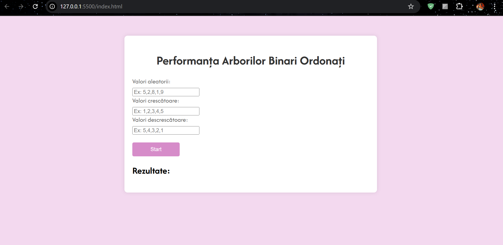

# proiect_map18
## Cerinta
    Performanța arborilor binari ordonați – Se dă un arbore binar ordonat care se
populează cu elemente provenite dintr-un fișier de intrare. Să se determine
performanța la inserare, căutare și ștergere pentru fiecare dintre următoarele
tipuri de fișiere de intrare:
a. Fișier cu valori aleatorii
b. Fișier cu valori crescătoare
c. Fișier cu valori descrescătoare

## Descriere
    Am dezvoltat o aplicatie web care analzeaza performanta arborilor binari ordonati, 
in funtie de 3 inputuri. Aceste inputuri reprezinta siruri de numere random, crescatoare si descrescatoare 
introduse de la tastatura de catre utilizator. Prin apasarea butonului de start, se v-or genera 3 liste,
fiecare dintre ele reprezentand un ranking al performantei. Fiecare dintre cele 3 procese (inserare, cautare, stergere)
are propriul ranking, pe primul loc fiind numit imputul care a generat cel mai rapid operatiunea in arbore.

## Descriere tehnica
### front-end
    Am realizat interfata folosind HTML si CSS pentru a o stiliza. Div-ul principal este plasat in mijloc,
continand 2 div-uri secundare si un tag _button_:
1. _Primul div_ : alcatuit din 3 tag-uri input, ce permit preluarea datelor introduse de utilizator, 
impartind acelasi id, care v-a ajuta la preluarea si prelucrarea datelor;
2. _Al doilea div_ : are o forma neregulata, fiind alcauit in principal dintr-o lista neordonata,
generata la finalizarea algoritmului;
3. _tag-ul button_ : acesta porneste procesul.

### back-end
    Partea de back-end a proiectului a fost realizata in limbajul JavaScript vanilla. Am ales acest limbaj 
din 3 mari motive: 
1. _Performanță_: codul este mai rapid deoarece nu depinde de framework-uri externe;
2. _Control_: ofera control total asupra funcționalității și nu ești limitat de constrângerile unui framework;
3. _Compatibilitate_: JavaScript vanilla funcționează în toate browserele moderne.

__Functii principale__ :

1. Setarea putonului "START"
- utilizeaza metode precum: "getElementById", "addEventListener" pentru a configura butonul ;
- se apaleaza functia "getUserInput".

2. "getUserInput" : 
- preia informatiile de la id-urile "input" din HTML ;
- le stocheaza in 3 variabile constante, ca siruri de caractere ;
- converteste string-urile in vectori de numere ;
- apeleaza functia "measurePerformance" pentru fiecare vector in parte.

3. "measurePerformance"
- alcatuita din 3 instructiuni "for" care arcurg tot arborele ;
- fiecare "for" este destinat unei operatiuni: inserare, cautare, stergere, apeland functiile corespunzatoare ;
- prin metoda "getElementById" comunica cu interfata vizuala pentru a afisa, pe rand, fiecare rank.

__Fuctii secundare__ :
1. "insert"
- insereaza un nod cu valoarea "data" in arbore, avand radacina in "root". 

2. "search"
- cauta un nod cu valoarea "key", "root" indicand radacina arborelui sau subardorelui unde se efectueaza cautarea;
- am utilizat cautarea in adancime ;
- functia se apeleaza recursiv.

3. "delete"
- daca "root" == null, inseamna ca a ajuns la capatul arborelui fara să gaseasca nodul, astfel, nu are ce sterge si returneaza null ;
- daca key < valoarea nodului curent (root.data), cauta in subarborele stang ;
- daca key > valoarea nodului curent (root.data), cauta in subarborele drept ;
- daca am gasit nodul de sters (key == root.data), avem 3 cazuri:
  - daca nodul _este o frunza_, il elimimin pur si simplu setandu-l la null ;
  - daca nodul _are doar un copil_ (stâng sau drept), putem înlocui nodul șters cu acel copil ;
  - daca nodul _are doi copii_, e inlocuit cu cel mai mic nod din subarborele drept, gasit cu ajutorul functiei "findMin". Dupa inlocuirea nodului, sterge inlocuitorul din subarborele drept.

__Variabila "operationsCount"__
- aceasta numara operatiile necesare fiecarui pas din proces ;
- pe baza acestei valori, se formeaza treptat fiecare clasament.